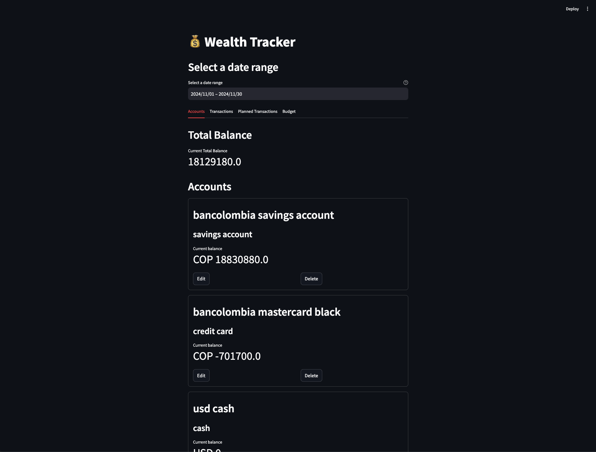

# wealth-tracker frontend

```shell
cd frontend-streamlit

python3 -m venv .venv

source .venv/bin/activate

pip install -r requirements.txt

python -m streamlit run app.py
```

You should see something like this:



### TODO:
- [ ] Dockerize FastAPI + Database
- [ ] Add tests